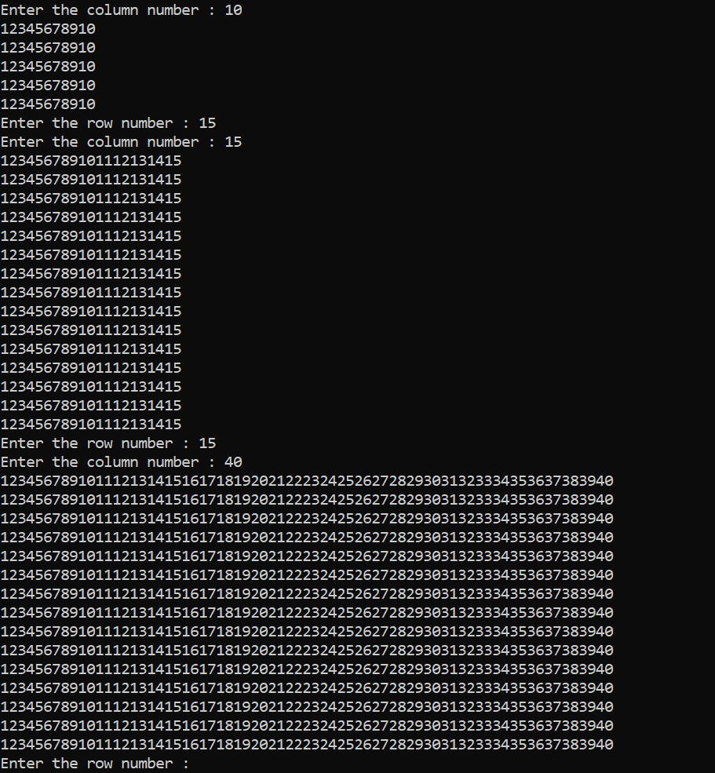

<!--Markdown Practice-->
write a programme that print square pattern

---
_P_ __a__ ~~tt~~ `ern`

### square

```c
#include<stdio.h>
int main()
{
    while(1)
    {
    int rownum,columnnum,row,column;
    printf("Enter the row number : ");
    scanf("%d",&rownum);
    printf("Enter the column number : ");
    scanf("%d",&columnnum);

    for(row=1; row<=rownum; row++)
    {
        for(column=1; column<=columnnum; column++)
        {
            printf("%d",column);
        }
        printf("\n");
    }
    }
    getchar();
}

```  

<!---->


`remaining`